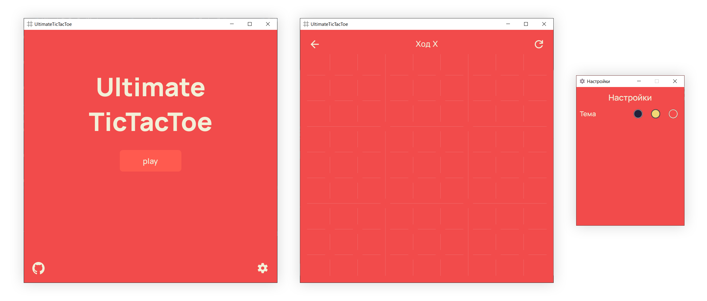

# Ultimate TicTacToe

[Ultimate TicTacToe](https://en.wikipedia.org/wiki/Ultimate_tic-tac-toe) on PyQt5

Yandex.Lyceum project



## Installation

1. You should have [Python 3.6+](https://www.python.org/downloads/) and [Git](https://git-scm.com/downloads) installed on your local machine.

2. Clone repository:

```bash
git clone https://github.com/dreamonovich/Ultimate-TicTacToe.git
```

3. Change directory:

```bash
cd Ultimate-TicTacToe
```

4. Create a virtual environment (recommended):

```bash
python -m venv venv
```

5. Install dependencies:

```bash
pip install -r requirements.txt
```
